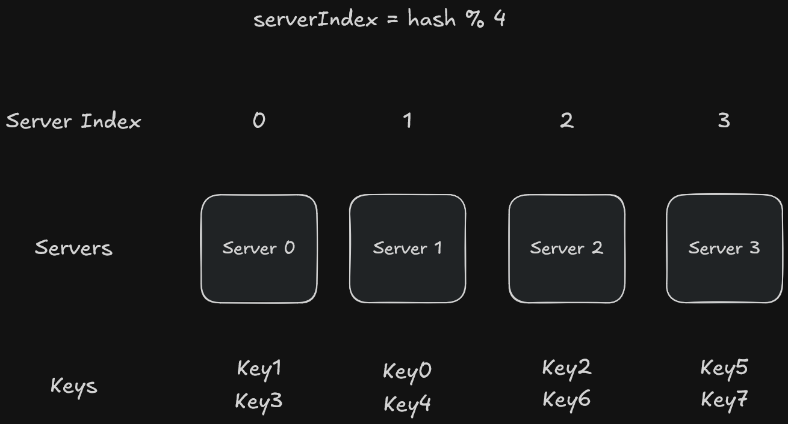
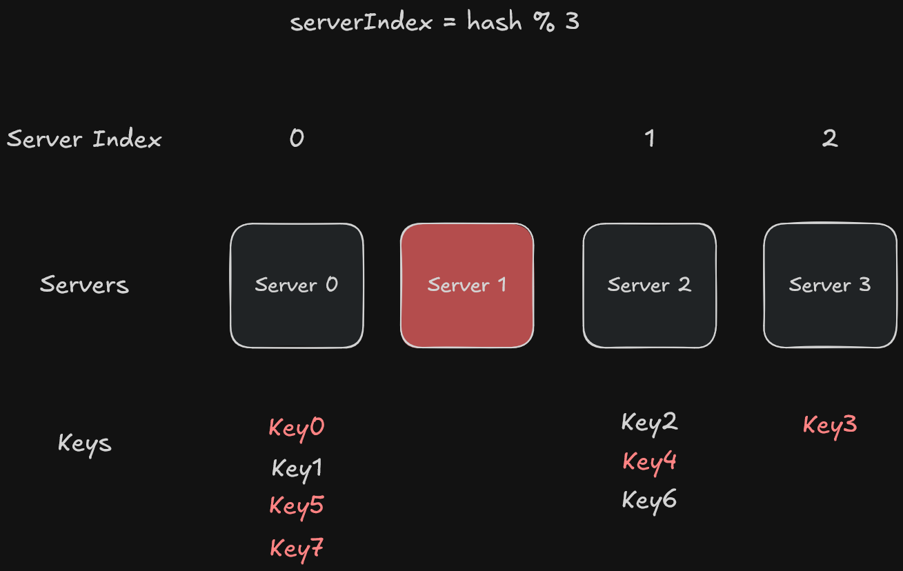
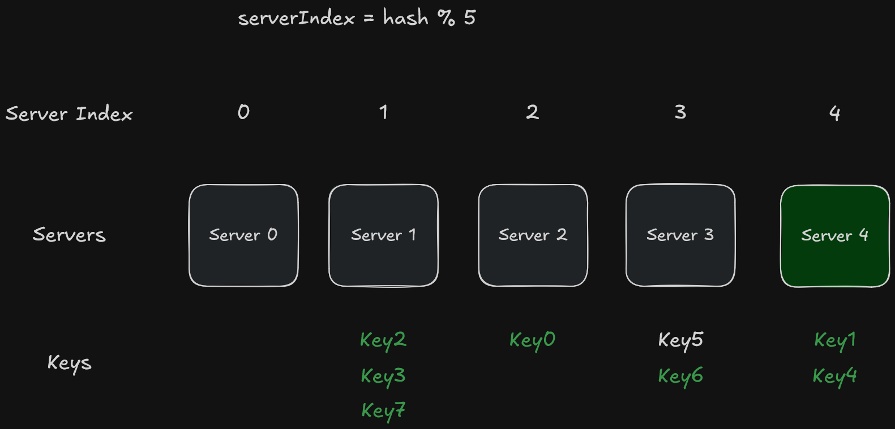

# 🚀 Design Consistent Hashing

## 🔗 Details

* **Original Title:** *Design Consistent Hashing*
* **Author / Company:** *ByteByteGo*
* **Link to Post:** [Read the full content here 🌐](https://bytebytego.com/courses/system-design-interview/design-consistent-hashing)

---

## 📝 Notes

Consistent hashing is a technique used to scale horizontally (distributing requests and data efficiently and uniformly across servers).

### The rehashing problem

If we have multiple cache servers, a very common approach is to use the following method:

> **serverIndex = hash(key) % N** ---> **N** is the size of the server pool

For this example, let's assume we have **4** servers and **8** string keys!

| key | hash | hash % 4 |
| :---: | :---: | :---: |
| key0 | 18358617 | 1 | 
| key1 | 26143584 | 0 | 
| key2 | 18131146 | 2 | 
| key3 | 35863496 | 0 | 
| key4 | 34085809 | 1 | 
| key5 | 27581703 | 3 | 
| key6 | 38164978 | 2 | 
| key7 | 22530351 | 3 | 

To find the server where the key is stored, a modular operation `f(key) % 4` must be performed. Therefore, when executing the operation `hash(key0) % 4 (18358617 % 4) = 1`, the client must contact **server 1** to fetch the cached data.

⚠️ This approach works well when the size of the server pool is fixed and the data distribution is uniform. Problems arise when new servers are added or existing ones are removed. ⚠️

#### Example of a removed server:

Let's imagine that **server 1** goes down; the size of the server pool will drop from **4** to **3**. When using the same hash function, we will get the exact same hash value for the key. However, if we apply modular operations, we will get different server indexes, precisely because the number of servers was reduced by 1.

For this example, let's assume we have **3** servers and **8** string keys!

| key | hash | hash % 3 |
| :---: | :---: | :---: |
| key0 | 18358617 | 0 | 
| key1 | 26143584 | 0 | 
| key2 | 18131146 | 1 | 
| key3 | 35863496 | 2 | 
| key4 | 34085809 | 1 | 
| key5 | 27581703 | 0 | 
| key6 | 38164978 | 1 | 
| key7 | 22530351 | 0 | 

To find the server where the key is stored, a modular operation `f(key) % 3` must be performed. Therefore, when executing the operation `hash(key0) % 3 (18358617 % 3) = 0`, the client must contact **server 0** to fetch the cached data.

#### Example of an added server:

For this example, let's assume we have **5** servers and **8** string keys!

| key | hash | hash % 5 |
| :---: | :---: | :---: |
| key0 | 18358617 | 2 | 
| key1 | 26143584 | 4 | 
| key2 | 18131146 | 1 | 
| key3 | 35863496 | 1 | 
| key4 | 34085809 | 4 | 
| key5 | 27581703 | 3 | 
| key6 | 38164978 | 3 | 
| key7 | 22530351 | 1 | 

To find the server where the key is stored, a modular operation `f(key) % 5` must be performed. Therefore, when executing the operation `hash(key0) % 5 (18358617 % 5) = 2`, the client must contact **server 2** to fetch the cached data.

    Most keys are redistributed, not just the ones originally stored on the removed/added server. This means that when a server goes offline or a new one is added, most cache clients connect to the wrong servers to fetch data. This causes a cache miss storm. Consistent hashing is an effective technique to mitigate this problem.

---

## ❓ My Questions / Doubts

- Which algorithm is used in the `hash()` function to generate the hash values for the keys?
    - MurmurHash, FNV-1a (Fowler–Noll–Vo), Ketama, etc.

- When adding new servers, should the number of "string keys" increase? 
    - In the example used, it was pure coincidence that none of the 8 keys resulted in a remainder of **0** from the `f(key) % 5` operation. In real-world systems with millions of keys, statistical distribution guarantees that server 0 would receive keys. However, this highlights a major issue known as "Hotspots & Waste"!
        - This can lead to a significant waste of hardware resources, as we added another server to help, but one of the servers ended up with no work to do.

---

*Last updated on: June 11, 2026.*